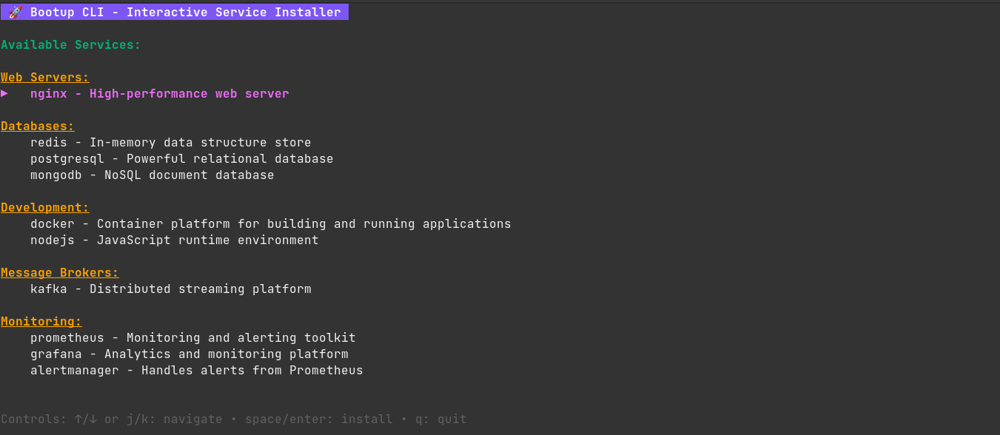

# Bootup CLI

A powerful command-line tool for quickly installing and configuring common server applications and development tools on Linux systems.

## 🚀 Features

- **Easy Installation**: Install popular server applications with a single command
- **Multiple Services**: Support for databases, web servers, monitoring tools, and more
- **Auto-configuration**: Automatically handles package updates and dependencies
- **Interactive Interface**: User-friendly commands with helpful output messages

## 📦 Supported Services

- **Web Servers**: Nginx
- **Databases**: PostgreSQL, MongoDB, Redis
- **Development**: Node.js, Docker
- **Message Brokers**: Apache Kafka
- **Monitoring**: Prometheus, Grafana, Alertmanager

## 🛠️ Installation

### Prerequisites

- Linux-based operating system (Ubuntu/Debian recommended)
- `sudo` privileges for package installation

### Quick Install (Recommended)

Install the latest version with our installation script:

```bash
curl -sSL https://raw.githubusercontent.com/amirkh8006/bootup-cli/main/install.sh | bash
```

### Download Pre-built Binary

1. Go to [Releases](https://github.com/amirkh8006/bootup-cli/releases)
2. Download the binary for your platform (e.g., `bootup-linux-amd64`)
3. Make it executable and move to PATH:
```bash
chmod +x bootup-linux-amd64
sudo mv bootup-linux-amd64 /usr/local/bin/bootup
```

### Build from Source

**Requirements**: Go 1.25.1 or higher

1. Clone the repository:
```bash
git clone https://github.com/amirkh8006/bootup-cli.git
cd bootup-cli
```

2. Build the application:
```bash
go build -o bootup
```

3. (Optional) Move to PATH:
```bash
sudo mv bootup /usr/local/bin/
```

### Install via Go

```bash
go install github.com/amirkh8006/bootup-cli@latest
```

## 📖 Usage

### Interactive TUI Mode (Recommended)
```bash
bootup
```

Launch the interactive Text User Interface (TUI) for an intuitive way to browse and install services. The TUI provides:



### List Available Services
```bash
bootup list
```

This will display all available services you can install.

### Install a Service

```bash
bootup install <service-name>
```

## 🤝 Contributing

1. Fork the repository
2. Create your feature branch (`git checkout -b feature/amazing-feature`)
3. Commit your changes (`git commit -m 'Add some amazing feature'`)
4. Push to the branch (`git push origin feature/amazing-feature`)
5. Open a Pull Request

## 📝 License

This project is licensed under the MIT License - see the [LICENSE](LICENSE) file for details.

## 🐛 Issues & Support

If you encounter any issues or have suggestions for improvement, please [open an issue](https://github.com/amirkh8006/bootup-cli/issues) on GitHub.

**Made with ❤️ by [Amir](https://github.com/amirkh8006)**
