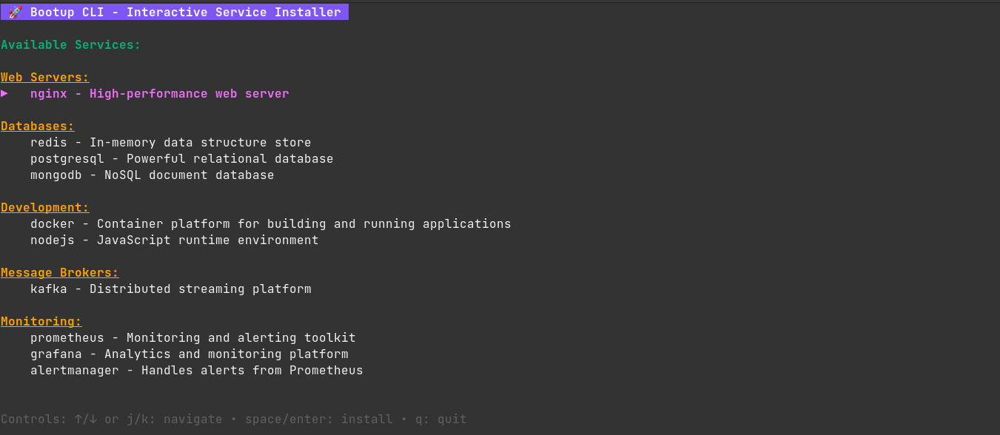

# Bootup CLI

A powerful command-line tool for quickly installing and configuring common server applications and development tools on Linux systems.

## 🚀 Features

- **Easy Installation**: Install popular server applications with a single command
- **Multiple Services**: Support for databases, web servers, monitoring tools, and more
- **Auto-configuration**: Automatically handles package updates and dependencies
- **Interactive Interface**: User-friendly commands with helpful output messages
- **Iran Mirror Support**: Configure Iranian mirrors for apt, npm, pip, Docker, and Go to fix network issues on Iran-hosted servers

## 📦 Supported Services

- **Web Servers**: Nginx, Caddy
- **Databases**: PostgreSQL, MongoDB, Redis, MariaDB, ElasticSearch, MySQL
- **Storage**: rustFs, SeaweedFS
- **Development**: Python, Node.js, Golang, PHP, Docker
- **Message Brokers**: Apache Kafka, RabbitMQ
- **Monitoring**: Prometheus, Grafana, Alertmanager
- **Prometheus Exporters**: MongoDB Exporter, NGINX Exporter, Node Exporter, Postgres Exporter, Redis Exporter
- **Security**: Trivy

## 🛠️ Installation

### Prerequisites

- Linux-based operating system (Ubuntu/Debian recommended)
- `sudo` privileges for package installation

### Quick Install

**Global (via GitHub):**
```bash
curl -sSL https://raw.githubusercontent.com/amirkh8006/bootup-cli/main/install.sh | bash
```

**Iran servers (GitHub blocked — use mirror):**
```bash
curl -sSL https://bootup.amirhdev.ir/install.sh | BOOTUP_MIRROR=https://bootup.amirhdev.ir bash
```

## 📖 Usage

### Interactive TUI Mode (Recommended)
```bash
bootup
```

Launch the interactive Text User Interface (TUI) for an intuitive way to browse and install services.
**Just choose the service you want to install and press enter.**



### List Available Services
```bash
bootup list
```

This will display all available services you can install.

### Install a Service

```bash
bootup install <service-name>
```

### Custom Mirror

Use `BOOTUP_MIRROR` to download from any self-hosted mirror:

```bash
curl -sSL https://your-mirror.example.com/install.sh | BOOTUP_MIRROR=https://your-mirror.example.com bash
```

The mirror must serve binaries at `<BOOTUP_MIRROR>/releases/bootup-<os>-<arch>`.

### Download Pre-built Binary

1. Go to [Releases](https://github.com/amirkh8006/bootup-cli/releases)
2. Download the binary for your platform (e.g., `bootup-linux-amd64`)
3. Make it executable and move to PATH:
```bash
chmod +x bootup-linux-amd64
sudo mv bootup-linux-amd64 /usr/local/bin/bootup
```

### Build from Source

**Requirements**: Go 1.25.1 or higher

1. Clone the repository:
```bash
git clone https://github.com/amirkh8006/bootup-cli.git
cd bootup-cli
```

2. Build the application:
```bash
make build
```

3. (Optional) Install to PATH:
```bash
make install
```

### Install via Go

```bash
go install github.com/amirkh8006/bootup-cli/cmd/bootup@latest
```

## Iran Mirror Manager

If your server is hosted in Iran and faces network issues installing packages, use the built-in mirror manager to switch to Iranian mirrors.

### Interactive TUI
```bash
bootup iran
```

Launches an interactive TUI (same style as the main installer). Navigate with arrow keys, select with Enter.

**Screen 1 — pick a category:**

| Category | What it fixes |
|---|---|
| APT | `apt-get install` failures |
| npm | `npm install` failures |
| pip | `pip install` failures |
| Docker | `docker pull` failures |
| Go | `go get` / `go mod download` failures |

**Screen 2 — pick a mirror:**

Available providers: **Liara**, **ArvanCloud**, **ParsPack**, **Runflare** — or select **Default** to revert.

### Other Commands

```bash
# List all available mirrors with current status
bootup iran list

# Show which mirrors are currently active
bootup iran status

# Reset a specific category to default
bootup iran reset apt

# Reset all mirrors to default
bootup iran reset
```

### What gets changed

| Category | Config location |
|---|---|
| APT | `/etc/apt/sources.list` (backup saved to `.bootup.bak`) |
| npm | `npm config set registry` |
| pip | `/etc/pip.conf` |
| Docker | `/etc/docker/daemon.json` + daemon restart |
| Go | `go env -w GOPROXY` |

## 🤝 Contributing

1. Fork the repository
2. Create your feature branch (`git checkout -b feature/amazing-feature`)
3. Commit your changes (`git commit -m 'Add some amazing feature'`)
4. Push to the branch (`git push origin feature/amazing-feature`)
5. Open a Pull Request

## 📝 License

This project is licensed under the MIT License - see the [LICENSE](LICENSE) file for details.

## 🐛 Issues & Support

If you encounter any issues or have suggestions for improvement, please [open an issue](https://github.com/amirkh8006/bootup-cli/issues) on GitHub.

**Made with ❤️ by [Amir](https://github.com/amirkh8006)**
